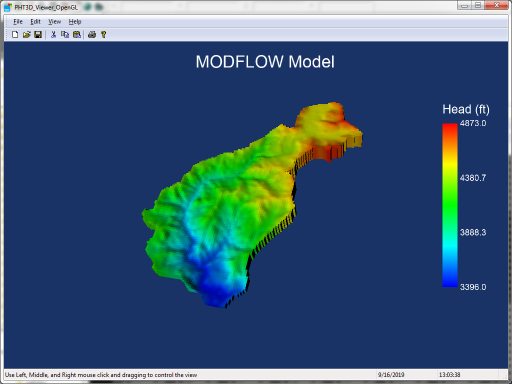

# PHT3D Viewer OpenGL
A Windows Graphical User Interface to visualize the output of MODFLOW, MT3DMS, and PHT3D models. It is a C++ application which utilises MS Visual Studio 2015 (v14), Standard template library, Windows template library (v10.9163), Boost template library (v1.70.0), and OpenGL library. The compiled Windows executable is located under the Release directory and the Example directory contains the test model shown below. This application is almost identical to PHT3D Viewer 3D, which uses the VTK library instead.

### Hydraulic head without Grid (Normal View)

### Hydraulic head without Grid and Zoom in

